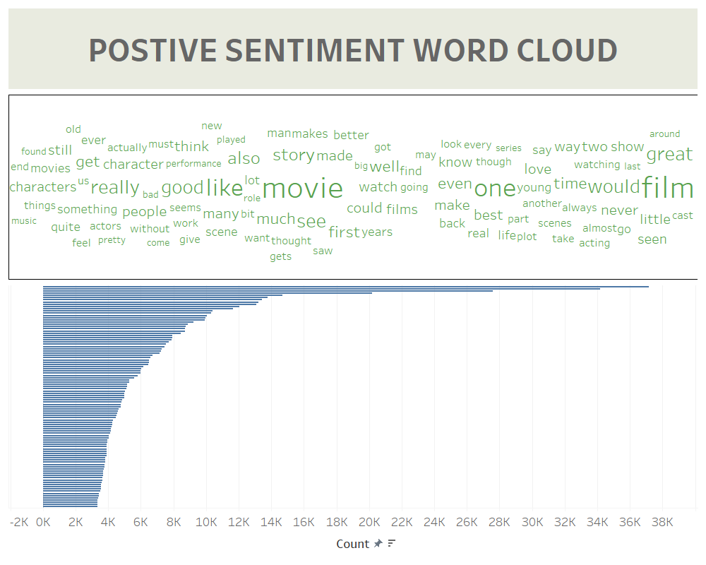

<p align="center">
  <a href="https://www.snowflake.com/"></a>
  <a href="https://www.tableau.com/"></a>
  <a href="https://www.python.org/downloads/release/python-380/"></a>
  <a href="https://en.wikipedia.org/wiki/SQL"></a>
</p>

# Psychology Insights Machine Learning Training (Snowflake)

This repository contains the code and resources for training machine learning models using Snowflake in the Psychology Insights project.

## Getting Started

To train the models using Snowflake, follow these steps:

1. Clone this repository :
```bash
git clone https://github.com/your-username/psychology-insights-snowflake-training.git
```
2. Setup Python environment with **Snowpark**:
```bash
cd psychology-insights-snowflake-training/
conda update conda
conda update python
conda env create -f ./conda_env.yml  --force
```
3. Update the Snowflake connexion file : **creds.json**
4. Activate Python environment using conda :
```bash
conda activate psychology-insights-snowflake-training
```
5. Start the Notebook:
```bash
jupyter notebook
```
6. Setup Database using the Notebook (**Setup_Database.ipynb**) 
7. Train the models using the Notebook (**Train_Model.ipynb**) 
8. Generate word cloud using the Notebook (**Train_Model.ipynb**)
9. Visualize word cloud using the Tableau (**positive-word-cloud.twbx**) 

Here's the Word Cloud visualization for positive sentiment using Tableau.


## Contributing

Welcome contributions to improve the machine learning training process in the Snowflake Training Repository. If you'd like to contribute, please follow these guidelines:

- Fork the repository and create a new branch for your feature or improvement.
- Commit your changes and push your branch to your forked repository.
- Submit a pull request, describing your changes in detail.

## License

This project is licensed under the [MIT License](LICENSE).
